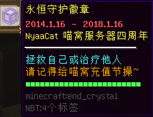
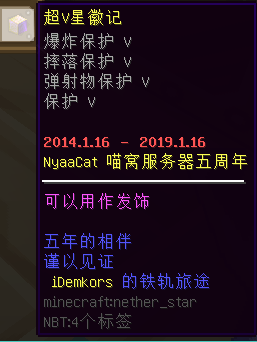
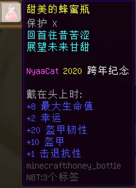

# 周年纪念道具

——仅会在每年喵窝生日（一月 1~16 日）之际，由管理员派发的纪念品。

### 永恒守护徽章

- **【年份】2018**
- 【外形】末影水晶
- 【物品类型】RPGItem
  + 【最大能量值】24
  + 【是否可充能】是，需现金节操
  + 在升级 1.14.4 版本前可用。在 1.15.2 版本被修复，恢复了功能。
  + 在 2020 年 3 月 30 日**以前**，充能价格为 100 节操 / 次。
- 【作用】
  + 放置于背包中，当遭受致命伤害时，给予拯救，每次消耗 8 点。
  + 手持徽章，对其他已受伤的玩家、生物按左键，即给予暂时的「生命恢复」效果，每次消耗 1 点。
  + 手持徽章，按右键为「系统余额」捐赠 800 节操，并恢复能量 5 点。捐赠随时皆可进行。

### 超V星徽记

- **【年份】2019**
- 【外形】下界之星
- 【物品类型】普通物品
  + 每个徽章独一无二，描述的最后有归属者的游戏ID，以及管理员对该玩家的记忆 / 印象（不过可应玩家要求修改之）。
- 【作用】
  + 作为头饰佩戴。

### 甜美的蜂蜜瓶

- **【年份】2020**
- 【外形】蜂蜜瓶，带有附魔
- 【物品类型】普通物品
- 【作用】
  + 饮用，或作为头饰佩戴。

### 狱火之黑金⛏

- **【年份】2021**
- 【外形】下界合金镐，带有附魔
- 【物品类型】实用工具
* 【作用】
  * 放于主手时，可获得若干加成。
* 【用途】
  + 作为普通的挖矿镐使用。由于**具有不毁属性**，使用时无需担心耐久。

附魔与加成详情

相关属性均为隐藏状态，不过可以借助 NBT Tooltip 等 mod 查看。

* 附魔：效率 X，时运 X
* 主手加成：+20 最大生命值，+2 幸运，+100% 击退抗性，+5% 速度
* 无法破坏

