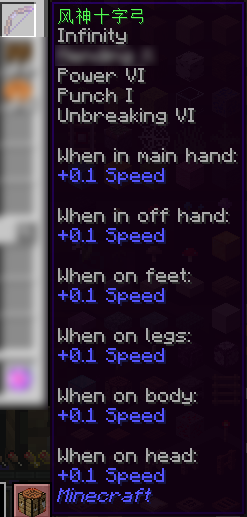
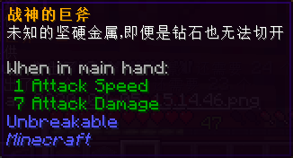

# 旧版装备道具

目前在喵窝世界尚具备价值的、早于 Minecraft 1.15 更新的物品。  
本页面中的物品暂时按（拼音）首字母排序。

### 风神十字弓

  
（图片中模糊的附魔是玩家自行添加的附魔。如果能够提供完全未修改的物品图片，感激不尽。）

* 【外形】弓
* 【物品类型】远程武器
* 【作用】
  * 放在主手或副手上，可**大幅增加玩家行走速度**。同时，此效果会大幅扩大视场（FOV）。
  * 当作普通的弓使用。

### 牦牛肉干

* 【外形】兔子脚
* 【物品类型】普通物品
* 【作用】
  * 作为头饰佩戴或放在副手。随后，可以获得上图所示的加成。

### 樱花发饰

* 【外形】粉红色染料
* 【物品类型】普通物品
* 【作用】
  * 作为头饰佩戴。佩戴以后，可以获得上图所示的加成。

### 战神的巨斧

* 【外形】金斧
* 【物品类型】实用工具 / 近战武器
* 【作用】
  * 作为普通的斧头使用。
  * 尽管没有任何加成，但拥有不可破坏（Unbreakable）的属性，因此无需担心耐久消耗。