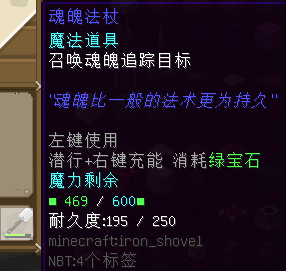

# 魔法装备及道具

以下道具皆由位于阿库亚斯的游商NPC「大魔法师」提供。  
*特别鸣谢：`gentlemio`*

#### 魔法飞弹

- 【外形】铁锹
- 【兑换需求】钻石块×18，金块×64
- 【最大魔力值】200
- 【是否可充能】是，需绿宝石
- **【作用】**对准目标，按左键发射导弹，导弹可追踪目标，造成高伤害。

#### 蓝宝石法杖

- 【外形】钻石锹
- 【兑换需求】钻石块×8，青金石块×64
- 【最大魔力值】600
- 【是否可充能】是，需绿宝石
- **【作用】**对准目标，按左键发射光束，光束可在小范围内追踪目标，造成较高伤害。

#### 紫晶石法杖

- 【外形】钻石锹
- 【兑换需求】钻石块×12，竖纹紫珀块×64
- 【最大魔力值】600
- 【是否可充能】是，需绿宝石
- **【作用】**对准目标，按左键发射紫色光束，光束可在小范围内追踪目标，造成较高伤害。

#### 红宝石法杖

- 【外形】？
- 【兑换需求】钻石块×12，红石块×64
- 【最大魔力值】？
- 【是否可充能】是，需绿宝石
- **【作用】**对准目标，按左键发射红色光束，光束可在小范围内追踪目标，造成伤害一般。  
相比以上两种法杖，弹道速度、转向性能更优。

#### 魂魄法杖

- 【外形】铁锹
- 【兑换需求】钻石块×18，羽毛×64
- 【最大魔力值】600
- 【是否可充能】是，需绿宝石
- **【作用】**对准目标，按左键发射“魂魄”。相比上述法杖，其追踪范围更大、伤害高，但弹道修正速度更慢。

#### *（待补充）*