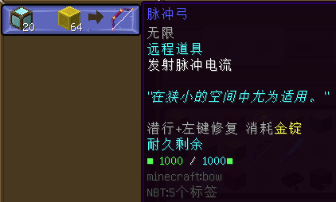

# 远程武器

以下道具皆由位于**柚木小镇**的游商NPC「狂野火枪手」提供。

#### 脉冲弓

- 【外形】弓，有附魔
- 【兑换需求】钻石块×20，金块×64
- 【最大能量值】1000
- 【是否可充能】是，需金锭
- **【作用】**
  + 对准目标，按右键稍微蓄力，发射脉冲电流。电流会直线穿行，对直线内的目标各造成**10点（:heart:×5）基础伤害**。
  + 有时会对单一目标瞬间暴击，产生**20点（:heart:×10）伤害**。
  + 电流在约0.2秒内前行约20米；当超出该距离或者遇障碍物，会向随机方向折射，折射后伤害不减。总计可折射两次。

*（待补充）*