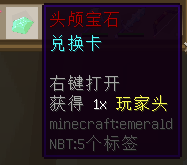
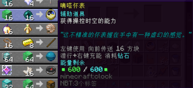
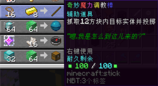
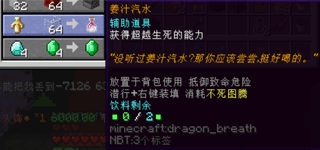
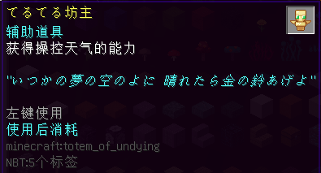
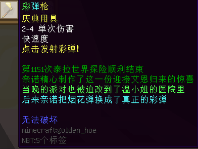
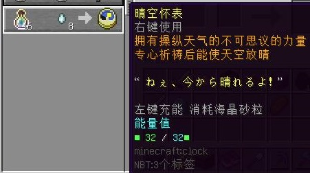
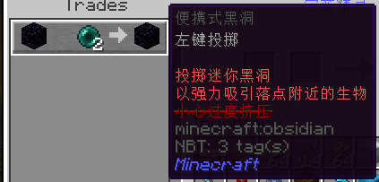

# 辅助道具

*最后更新：{docsify-updated}*

**辅助道具**一般是各类非原版实用工具、玩具等的总和。本页道具皆曾由以下 NPC 提供：
- 位于**樱华町**的游商 NPC「御魂匠」
- 在**琥珀川**活动的游商 NPC「宝蓝精灵」

因 NPC 下线，这些道具不再可兑换，但尚可使用。不排除将来也一并失效的可能。

?> :rice_ball: 此外，一些 NPC 也提供[快捷食品](space/items/support/foods.md)。

## 御魂匠

#### 头颅宝石

- 【外形】绿宝石
- 【兑换需求】钻石×4，绿宝石×4
- **一次性道具**
- **【作用】**按右键使用，抛出一个玩家头颅（使用自己的皮肤；带“幸运 +2”效果）。

#### 猩红针管

- 【外形】末地烛
- 【兑换需求】钻石块×16，下界之星×4
- 【最大能量值】100
- 【是否可充能】是，需闪烁的西瓜片
- **【作用】**按左键使用，获得 10 秒生命恢复效果。

#### 嘀嗒怀表

- 【外形】时钟
- 【兑换需求】绿宝石块×16，末影珍珠×16
- 【最大能量值】600
- 【是否可充能】是，需钻石
- **【作用】**主手持有时，持续给予「跳跃 II」效果。按左键使用，向前传送 16 格。此传送不能穿过方块。

#### 鹦鹉螺挂饰

- 【外形】鹦鹉螺壳
- 【兑换需求】附魔金苹果×16，不死图腾 x1
- 【最大耐久值】100
- 【是否可充能】是，需鹦鹉螺壳
- **【作用】**
  + 可手持，亦可**放置于背包**；当生命值扣除至零，即实施拯救（同不死图腾）。每次消耗 30 点耐久。
  + 若拯救时耐久值不足，则销毁自身完成拯救。

#### 奇妙魔力调教棒

- 【外形】木棍
- 【兑换需求】拴绳×16，金锭 x8
- 【最大耐久值】100
- 【是否可充能】否
- **【作用】**
  + 按右键，抓取面前 12 方块内的一个生物（玩家）。
    * 该生物（玩家）将坐在使用者的头上。
    * **注意：**最好在较远距离（三格外）对准目标抓取，否则抓取**极有可能失败、空耗耐久度**。
    * **注意：**被抓取的实体会遮挡视野，并会首先受到近战、窒息伤害。请切换视角，谨慎操作。
  + 抓取后，5 分钟内再次按右键，可将该生物（玩家）向视线方向掷出。
    * **以下生物无法掷出：可骑乘生物（如马）、已驯服生物（如猫犬）、NPC（即村民）。**
    * 若 5 分钟内未掷出、或者使用者退出主服务器/当前维度，该生物（玩家）将自动脱落。

#### Unity Stone

- 【外形】海洋之心
- 【兑换需求】信标 x64，绿宝石块 x64
- 无使用限制
- **【作用】**持于主手或副手栏，或作为头饰佩戴 `/hat`：
  + 持有时持续给予 5 秒「漂浮」效果、30 秒「缓降 X」效果。这可令你在当前高度的空中行走（但不会上升或下落）。
  + 持有时按潜行键，改为持续给予 1 秒「漂浮 III」效果（缓降不变），即可倒转重力。
  + **注意：**在“无尽地狱”世界`inf`的特定区域（如月耀城），你可能无法获得「漂浮」效果。
  + **注意：**使用后小心摔伤。

#### 冒险者罗盘（已失效）

**此道具作为Inf装备的一种被移除。**

先前描述（点击展开）

- 【外形】指南针
- 【兑换需求】末影水晶×1，下界石英 x16
- 【最大耐久值】200
- 【是否可充能】否
- **【作用】**
  + 持有时按潜行键，放置新的**传送信标**，并向全服玩家广播此事件。
    * 信标 30 秒内有效。
    * 每次放置信标，均会销毁先前既有的信标——也即，同一时刻内，**全服只能存在一个信标**。 
    因此，如多人需分享各自位置，应**错开**放置信标。
  + 左键使用，可传送至**全服当前有效的信标处**。
    * **注意：传送之前，你无法自行得知该信标的位置。请向放置者确认该处是否安全。**
  + 右键使用，传送至**大神殿**。
  + 传送冷却时间 150 秒（放置信标不受影响）。

#### 奇妙的无尽宝箱

- 【外形】箱子
- 【兑换需求】钻石块 x32，绿宝石块 x64
- **【作用】**
  + 将其放置，其会不定期刷新若干来自地牢的战利品。
    * 宝箱中的物品是开箱时一瞬间决定的（如果是第一次开箱，或已经达到刷新周期）。
    * 打开后，至少过一天才会刷新。
  + **注意：一旦放下再拆除，其将失效（即使使用精准采集附魔的工具）。**

#### 便携式鞘翅缝纫机

- 【外形】织布机
- 【兑换需求】铁块 x32，线 x64
- 【最大能量值】64
- 【是否可充能】是，需幻翼膜
- **【作用】**
  + 材料存量满时，按左键制作一个鞘翅（无属性）。
  + 未满时不可使用。

#### 蒸汽喷射推进器

- 【外形】高炉
- 【兑换需求】铁块 x32，红石块 x64
- 【最大能量值】64
- 【是否可充能】是，需煤炭
- **【作用】**左键使用，向前瞬间加速至 50 m/s。可用于起飞及飞行时加速，或者赶路。

#### 姜汁汽水

- 【外形】龙息
- 【兑换需求】不死图腾 x1，玻璃 x64
- 【最大能量值】2
- 【是否可充能】是，需不死图腾
- **【作用】**
  + 可手持，亦可**放置于背包**；当生命值扣除至零，如果尚有剩余饮料，即实施拯救（同不死图腾）。

#### 发明家动力背包

- 【外形】高炉
- 【兑换需求】损坏的铁砧 x16，烟花火箭 x16
  + 烟花样式：延时③，苦力怕状（黄绿色，淡化至黄色，闪烁）
- 【最大能量值】1024
- 【是否可充能】是，需通用电池模组
- **【作用】**按住右键使用，往视线方向喷气移动。
  + 注意：喷出的蒸汽可烫伤他人。

#### てるてる坊主

- 【外形】不死图腾
- 【兑换需求】线 x4，纸 x4
- **一次性道具**
- **【作用】**下雨时，按左键使用，使天空放晴。  
请注意，不同于自然的天气切换，使用后 10 分钟内必然再下雨（并且雷暴概率大大增加）。

- - -

## 宝蓝精灵

#### 彩虹喵之刃

- 【外形】铁剑
- 【兑换需求】热带鱼桶（小丑鱼）（注：没有前缀）+ 热带鱼桶（五彩搏鱼）
- 不限使用次数
- **【作用】**
  + 左键使用，发射一颗弹丸。弹丸受重力影响，以约 6 m/s 的速度，在空中划出一道五彩的抛物线。
  + 弹丸击中生物时，造成 10 点伤害，并穿过之。
  + 弹丸碰触方块时反弹，产生野猫的叫声。最多反弹 5 次。

#### 彩弹枪

- 【外形】定制材质
  + 如关闭服务器资源包，将显示为木铲。
- 【兑换需求】黄绿色带釉陶瓦 x64，红色带釉陶瓦 x64
- 不限使用次数
- **【作用】**
  + 右键使用，发射约 20 颗彩弹。
  + 左键使用，发射 2 颗彩弹。
    * 彩弹速度 20 m/s，击中生物时，可造成 2~4 点伤害。
  + **请于开敞环境使用，严禁对人、或在居民区燃放。**

#### 晴空怀表

- 【外形】时钟
- 【兑换需求】附魔之瓶 x16，恶魂之泪 x8
- 【最大能量值】32
- 【是否可充能】是，需海晶砂粒
- **【作用】**雨天时，右键使用，使天空放晴。  
请注意，不同于自然的天气切换，使用后 10 分钟内必然再下雨（并且雷暴概率大大增加）。

#### 便携式黑洞

- 【外形】黑曜石
- 【兑换需求】黑曜石 x1，末影珍珠 x2
- **【作用】**使用后消耗，投掷一个迷你黑洞，将周围的生物（玩家）卷入该处，并持续 5 秒。  
**请勿在生物密集处使用，以免造成不必要的损失。**
