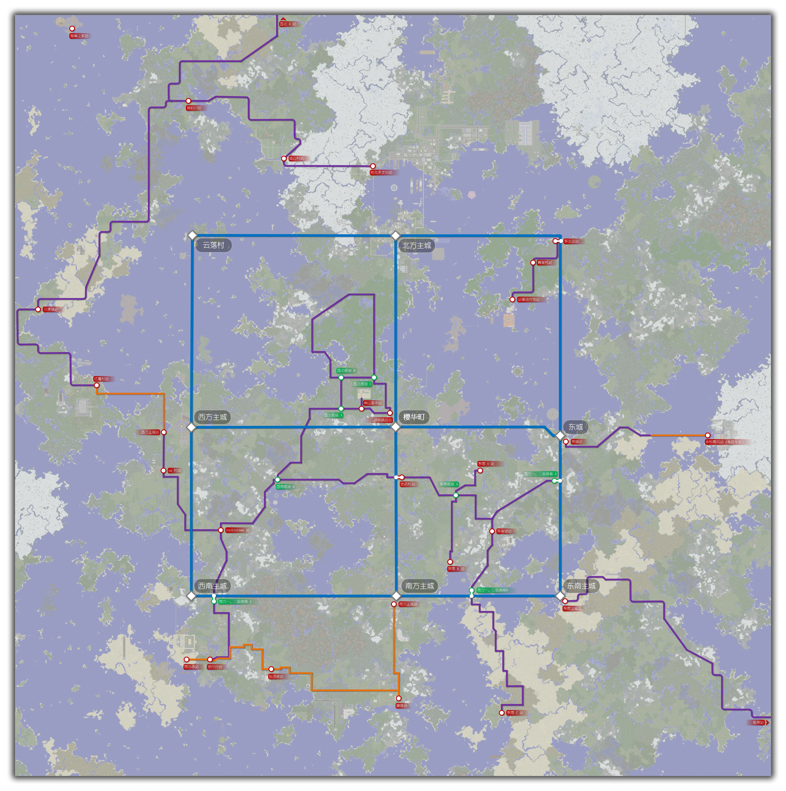
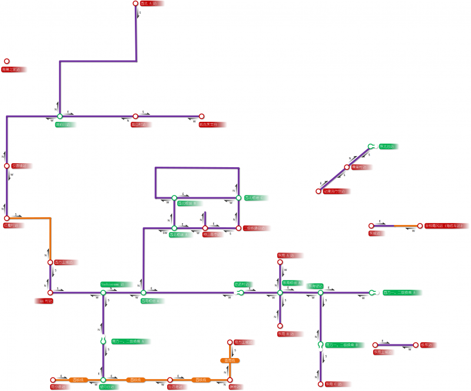

# 主世界铁路地图（已过时 | dmql版）

### 介绍

为了方便线上玩家在搭乘铁路旅行能够快速辨识自己的路线，请参照文档下方二级铁路地图和交通图。

交通图与铁路地图的主要区别是每个车站会标注具体的出发方向，线上铁路站台也有相应的方位告示牌来提示玩家通往对应的站台（详见《[铁路建设标准](space/building/railway-construction-standard.md#_13-站牌规范)》）。

*二级铁路原负责人：dmql*

现由管理员监督、全体玩家接管。

### 地图

以下线路图更新于2016年12月，可能不适合参考。请移步其它页面或BBS以获取最新的线路情况。
如果您需要喵窝核心区域的雷达卫星图（原先由 Web 动态地图担当），此线路图可在一定程度上给予帮助。

二级铁路图（卫星图/交通图）：

*（注：下图为webp格式，大小1.56MB，最新的浏览器皆可显示。[若无法显示，请点击此处查看。原图大小为25.7MB。](https://silverwei.github.io/NyaaCatTraffic/)）*

### 待建规划路线

*更新时间：`2016年11月23日`*

1. 东南主城——极东（已建成）
2. 琥珀川——胧白村（已建成）
3. 红魔村——夕凉镇——琥珀川（已建成）
4. 动漫流行馆——东北总站（已建成）
5. 琥珀川——海澜之家（正在规划）

### 搭乘事项

当您在准备搭乘铁路时，请注意：

- 请勿破坏铁路包括周边环境公共设施；遇到铁路有被破损的状况，请及时联系活跃玩家协助修复。
- 推荐搭乘的玩家自备弓箭，以防中途下车不能及时手动回收矿车。
- 一、二级铁路属于喵窝服务器公益性世界工程，永久无偿使用，凡与其对接者均自动无条件对公众开放。
  玩家搭建村落后，可自行规划并修建路线（须和现行标准统一），对接现有路网；然后，向已知线路图维护者反馈新路线。
- 您还有其他建议可与伙伴们协商。
