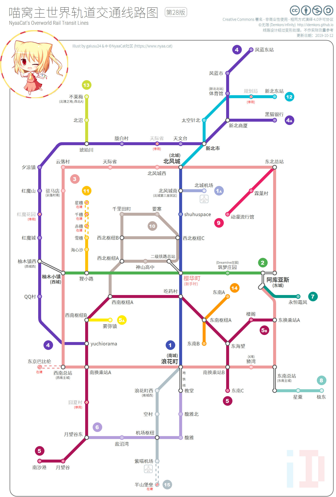
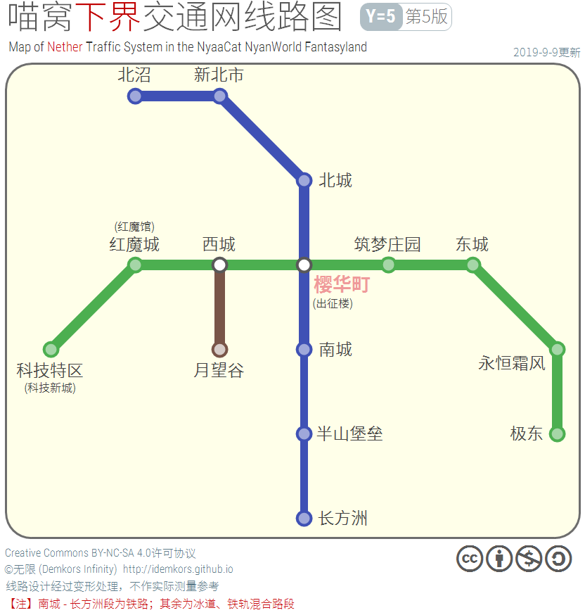

# 喵窝轨道交通线路图（“无限”版）

本页面主要展示由*无限 `iDemkors`* 绘制的 **《主世界轨道交通线路图》** **《下界交通网线路图》**，以及**城镇（村落）内修建的地铁线路图**。其中：

- **《主世界》**包括公认的“公共铁路网”（含“一级铁路”“二级铁路”），以及不属于“公共铁路网”、但与其**直接**接驳的线路。
- **《下界》**包括**由樱华町（出征楼）传送门附近出发**，在下界Y=5~9处铺设的交通网（含铁路线及冰、铁混合线）。
- **《新北市地铁》**包括新北市当前的4条地铁线、1条有轨电车线，以及过境的“公共”铁路线。
- **《南城地铁》**包括南方主城当前的3条地铁线，【村庄】站至【东海望城堡】的直达线，以及过境、接驳的“公共”铁路线。

## 阅览前请注意

1. **图中一切线路、站点的存在及名称，为基于“现状”判断而得，不代表管理组观点及喵窝全体共识，仅供参考。**
2. 部分站名由于实际上过长，不便记忆，而被改写。如：“南方一、二级换乘站A”→【南换乘站A】。  
   可以和[“二级铁路”页面](space/map-navi/railway-overworld-dmql)所示线路图对照，以获知实际站名。（该图为2016年下半年内更新，未包含新建站点。）
3. 《主世界》不区分“一级”、“二级”和其他铁路。
4. 线路之编号、配色仅仅起**装饰性**作用。引用时请慎重。
5. 患色弱、色盲者如遇辨识障碍，请立即联系作者。

### 温馨提示

1. 站点以线路上的**圆圈**表示。其中：  
   白底灰边者为**换乘站**（如各个主城）；  
   特别地，由一根“细棍子”连通两个换乘站，表示 **“跨平台换乘”**（如东城）；  
   其余为**普通站点。**
2. 南城地铁站牌标示大多为英文，作为文化遗产被保留。乘坐时，请自行判断欲经过的站台数量。
3. 某些站点名称未确定，给予了暂定名。本图尽可能尊重当地住户、建设者之意见，欢迎提供更合适的站名。

- - -

## 主世界线路图

?> :information_source: 【东城】三个站台分别称 *“东城站”“东城北站”“东城南站”*，分别接入②号线、③号线（北向）、③号线（南向）。

- - -

## 南城地铁线路图

- - -

## 新北市地铁线路图

- - -

## 下界交通网线路图

!> 更多搭乘指南请见[此页](space/map-navi/railway-nether "下界铁路搭乘指南")。