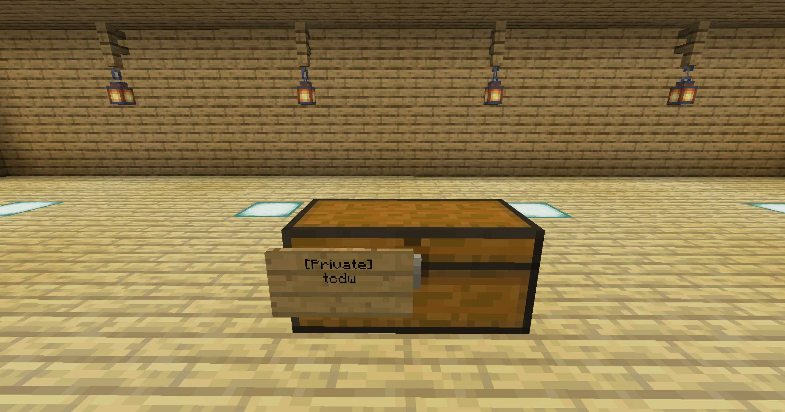
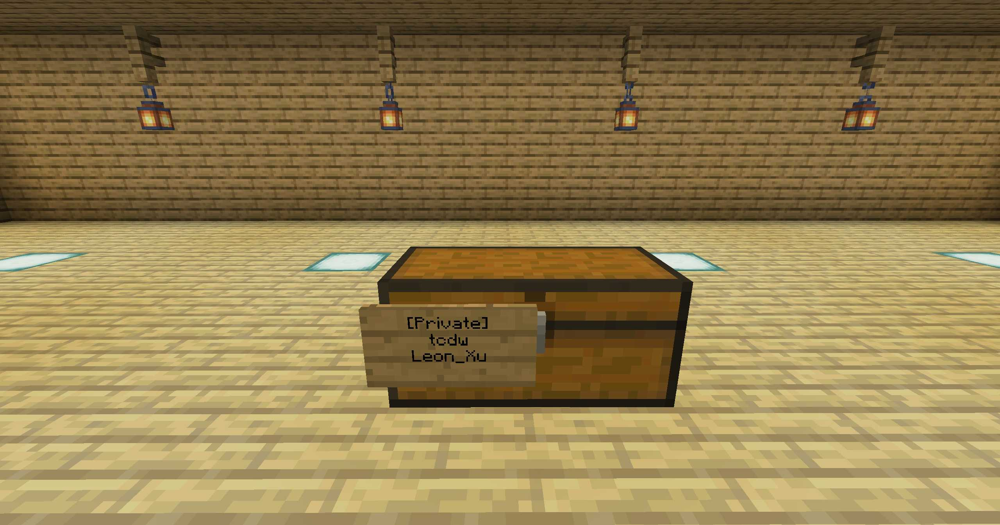
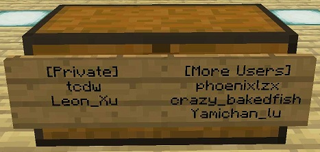
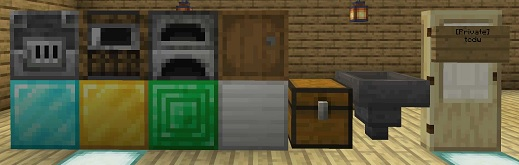
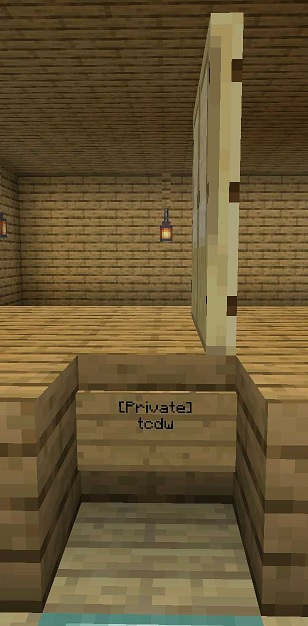
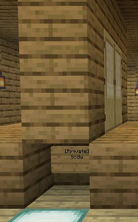

# LockettePro 插件指南

LockettePro 是一个帮助玩家在多人服务器保护自己财产的插件。

挖到钻石 / 绿宝石怎么办？抽到顶级装备怎么办？辛苦撸死只黑化掉了魔矿怎么办？当然您可以~~给卷卷交 450~~ 挖一个很秘密的洞放上箱子储存您的财产，但这并不是正确地保存财产的方法。如果有地精玩家挖到了您的箱子，财产仍然会有丢失之虞。正确的方法是，使用 LockettePro 插件。

?> :information_source: 原版的 Lockette 与 LockettePro（前者的衍生版本）均已年久失修，因此目前喵窝使用的是自己维护的版本。如果希望查看源代码、反馈技术问题、参与贡献等，请戳 [这里](https://github.com/NyaaCat/LockettePro)。

!> **请勿在“无尽地狱”世界（`inf`维度）使用告示牌**，锁定后无法自行拆除。如不慎锁定，请立即共享给所有人（见下），然后联系管理员处置。

## 快速入门

用告示牌右键单击没有人声明主权的箱子，然后就可以将木箱设置为私有，**其它人无法以任何方式打开箱子或者提取箱子内的物品**，如下图所示。

  
<small>一个被玩家 `tcdw` 声明拥有主权的箱子。</small>

如果**不希望**上锁，可以按住 Shift 键放置木牌，然后编写其它东西。

!> 任何种类的告示牌用于锁定之后，将自动变为**橡木**告示牌。

!> 告示牌使用的位置**不能有水**，否则无法锁定。

### 我想把这个箱子分享给更多的玩家

您可以将箱子设置为多人有权限使用，但需要注意的是仍然**只有您可以破坏这个箱子**：

* 右键需要分享的箱子的锁箱木牌
* 执行命令 `/lock [行号] [内容]`。行号的有效范围介于 3 - 4 之间，内容可以是：
  * 玩家 ID
  * `[Everyone]`（共享给所有人）
  * 自定义文本（支持格式符号，但不支持空格）

如下图所示。

  
<small>一个被玩家 `tcdw` 声明拥有主权、`Leon_Xu` 可以打开的箱子。</small>

### 但是我觉得分享给两名玩家不够，怎么办？

用告示牌右键单击由您声明占有的箱子外面的其它位置，即可添加「更多用户」木牌。然后，用 `/lock` 命令向「更多用户」木牌添加要共享的玩家 ID；在这里，行号的有效范围介于 2 - 4 之间。

  
<small>一个被玩家 `tcdw` 声明拥有主权、4 名指定玩家可以打开的箱子。</small>

**「更多用户」木牌的粘贴数量没有上限，只要确保他们贴在箱子上面即可。** 这意味着通过适当的摆放，您最多可以给一个箱子设置 17 个共享的玩家 ID。

### 我能锁其它的东西么？

您可以利用这个插件锁住门、贵重的方块和其它一切包含存储空间的方块（**潜影盒**、**发射器**和**投掷器**除外）。

用告示牌右键单击可以了。


  
<small>目前可以被上锁的方块。</small>

对于门来说，您还可以设置开启时间。通过 `/lock` 命令在木牌上添加一行：

```none
[timer:时长]
```

即可。其中，时长的单位是秒，您可以自行指定数值。

例如，`[timer:2]` 将会导致在门被开启 2 秒后自己关闭。

## 技巧

#### 一种隐藏锁门木牌的方法

在门下方的方块旁，挂牌锁定，然后以墙壁和地板遮蔽之。如下图：
 
  
  


### 其它

* 该插件还可以间接实现：
  * 点击一次，即可完整打开两个门扇的门。
  * 徒手打开铁门。

### 嗯，我想保护展示框里的东西，怎么办呢？

[这个功能 NyaaUtils 做了。](space/plugins/nyaautils?id=在展示框中)
