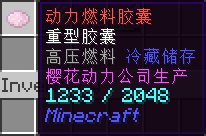

# NyaaUtils 插件指南

NyaaUtils 包含了各类杂项辅助功能，本页面列出该插件在喵窝服务器的详细使用指南。

一切功能如无特殊说明，均为（游戏内）免费使用。

如果需要反馈问题，或者希望参与开发、翻译、整理文档等，请戳 [GitHub 页面](https://github.com/NyaaCat/nyaautils)。

## 装扮相关

### 多彩文字
*Minecraft* 原生支持 16 种文字色彩和粗体、下划线等样式；但在原版，除告示牌外，必须搭配难以输入的字符 `§` 方可使用彩色。而在喵窝，**只需使用 `&` 即可。**  
游戏中可用命令 `/nu format` 查询可用样式。

除预先提供的 16 种颜色以外，**还可以使用 RGB 彩色文本。**其样式代码为 `&` 紧跟 HTML 表记的颜色代码，如 `&#66ccff好喝的水`；暂不支持简写颜色代码。

可以在聊天栏，以及本插件所有命名功能（前后缀、物品重命名、预编辑告示牌）等处使用多彩文字。

在执行下列各种命名类命令前，可用命令 `/echo [文本内容]` 进行测试，以免浪费节操；通过该命令发送的测试内容，不会被别人看到。

* [样式代码介绍](https://minecraft-zh.gamepedia.com/%E6%A0%B7%E5%BC%8F%E4%BB%A3%E7%A0%81)（[内地镜像](https://wiki.biligame.com/mc/%E6%A0%B7%E5%BC%8F%E4%BB%A3%E7%A0%81)）
* [RGB 调色板](https://www.matools.com/color)
* [彩虹渐变文本生成器](http://patorjk.com/text-color-fader/)（[使用说明](https://bbs.nyaa.cat/d/1762)）

!> 大量使用 RGB 彩色文本可能会导致你的消息/命令字数长度迅速达到上限（256 个字符）。

!> 黑色字 `&0` 在聊天栏中会被展示为白色。

### 更改前后缀、昵称 :id=prefix-suffix

可以修改在游戏内的昵称（取代游戏 ID 显示，但不影响之），或者前后缀。建议包含可方便认识你的中文昵称。

请勿使用过长或有不良内容或假冒他人之文字！

| 目的 | 命令 | 费用 |
| - | - | - |
| 设置/修改前缀 | `/nu prefix [前缀]` | 198 节操 + 100 经验/次 |
| 重置（清空）前缀 | `/nu resetprefix` | 免费 |
| 设置/修改后缀 | `/nu suffix [后缀]` | 99 节操 + 100 经验/次 |
| 重置（清空）后缀 | `/nu resetsuffix` | 免费 |
| 自定义昵称 | `/nick` | 免费 |
| 清除自定义昵称 | `/nick off` | 免费 |

<details>
<summary>🎨<span class="nw-important">希望使用空格、多彩文字？</span></summary>

文本可使用空格，请使用半角反引号 ``` ` ``` 包围整个名称内容。  
文本支持[多彩文字](#多彩文字)。

示例：

```
/nu suffix `&4柠檬 &6果酱蛋糕`
```
</details>

### 粒子效果

可以通过 NyaaUtils 为自己、鞘翅和弹射物增加粒子特效。

[详细介绍](space/plugins/nyaautils/particle)

## 飞行相关

#### 飞行动力

!> **飞行燃料暂不可用。**请以烟花火箭替代，并等待该问题修复。

* ~~将**动力燃料胶囊**放置于背包，展开鞘翅滑翔即可消耗燃料获得飞行动力。玩家将被不断向前推进，从而做到不间断、任意方向角度和特技的飞行。~~
* 目前可以在 [北风城市政厅](nyaa/realms/northwind?id=北风城市政厅) 自主兑换动力燃料胶囊。各城市/村落商业街或天喵商城亦可能有玩家出售已经兑换好的胶囊。
* 因加速判断是在玩家飞行速度低于一定程度（1.0）后自动加速到指定速度（1.6），所以如果做出会造成大量减速的任何动作，将会导致急速消耗燃料。如何利用少量燃料飞行最远距离，以及如何安稳的精准降落，是需要多加练习与研究的技巧！
* 背包中动力燃料胶囊储能过少，或者鞘翅耐久过低时会通知玩家尽快降落，以免出现事故。
* 如果不希望消耗燃料，可以使用 `/nu el` 来切换动力模式。
* 此功能在 `brainhole` 世界不可用。

  
<small>动力燃料胶囊外观</small>

#### 飞行塔弹射器

飞行塔弹射器可以通过命令方块帮助使用鞘翅的玩家在飞行塔开始飞行时，自动张开鞘翅，并立即提升速度到足够飞行的水平。  
部分聚落内的飞行塔，已实装弹射装置。穿戴鞘翅，踩上踏板即可弹射。

## 物品相关

### 物品寄送 :id=postal-service

可在游戏内将手上的物品或箱子内的全部物品发送给其他玩家或自己。

请注意发送整箱物品必须拥有该箱子的权限，也请勿在任何活动中不当使用此功能！

?> :heavy_check_mark: 操作方法

* 创建邮箱：
  1. 执行命令 `/nu mailbox create`
  2. 然后右键点击要用来当作收件箱的箱子
* 删除邮箱：`/nu mailbox remove`
* 查看邮箱信息：`/nu mailbox info`
* 发送手中物品：`/nu mailbox send [玩家 ID]`，每次邮费 1 节操
* 发送一箱物品：
  1. 执行命令 `/nu mailbox sendchest [玩家 ID]`
  2. 然后右键点击箱子发送一箱物品
  3. 一次收取邮费 39 节操

### 物品展示

#### 在手中

展示手中的物品：`/nu show`。

执行后，展示行为会广播给全服玩家，包括自己；将鼠标移至聊天栏中的该物品名称上，可观看其信息（包括耐久、Lore 等 NBT 标签，但外形不可见）。  
被展示的物品信息不会更新。

#### 在展示框中

可以将物品放入展示框中，并使用 NyaaUtils 的展示框保护功能，以保护展示框不被破坏。玩家右键被保护的展示框，可在聊天栏中观看物品的 NBT 信息。  
如果展示的是**成书**，右键则直接观看其内容。

无论对此展示框如何操作——包括通过破坏其挂靠的方块令其掉落，也不能获得展示的物品。

?> :heavy_check_mark: **设置和取消方法**

1. 首先，你需要一个展示框，和要展示的物品。
1. 然后，把展示框挂墙上，把物品放展示框里。
1. 准星对准展示框，输入 `/nu exhibition set`。
1. 物品会退还给你，设置完成。
  - 还可设定一些描述文本——其将在右键点击时一并显示。只需对准此展示框执行 `/nu exhibition desc <行数> <文本>` 即可。注意行数从 0 开始计数。
1. 如要取消物品的展示，需面对展示框，执行 `/nu exhibition unset`。

<details>
<summary>🎨在描述文本中<span class="nw-important">希望使用空格、多彩文字？</span></summary>

文本可使用空格，请使用半角反引号 ``` ` ``` 包围整个内容。  
文本**不支持**[多彩文字](#多彩文字)。

示例：

```
/nu exhibition desc 0 `柠檬 果酱蛋糕`
```
</details>

### 物品重命名 :id=rename

使用 `/nu rename [名称]` 可以重命名手中的物品，例如 `/nu rename &7&l好喝的水`。价格为 45 节操 / 个。

请注意，**重命名是针对单个物品收费**。如果手中持有 64 个物品，执行命令后将收取 **64 x 45 = 2880** 节操。
  
<details>
<summary>🎨<span class="nw-important">希望使用空格、多彩文字？</span></summary>

文本可使用空格，请使用半角反引号 ``` ` ``` 包围整个名称内容。  
文本支持[多彩文字](#多彩文字)。

示例：

```
/nu rename `&4柠檬 &6果酱蛋糕`
```
</details>

## 战斗/装备相关

### 战利品保护

击杀怪物后，掉落的物品会自动放到最后击杀的玩家背包内。可选择对于原版物品（没有 lore 的物品；含经验球）是否忽略、乃至拒绝拾取。

?> :game_die: 相关命令

| 模式 | 命令 | 非原版物品…… | 原版物品…… |
|-|-|-|-|
| 关闭功能 | `/nu lp` | 掉落于原地 | 掉落于原地 |
| 开启，拾取全部<br />*（默认）* | `/nu lp ac` | 自动拾取 | 自动拾取 |
| 开启，忽略原版 | `/nu lp ig` | 自动拾取 | 掉落于原地，经过时才拾取 |
| 开启，拒绝原版 | `/nu lp re` | 自动拾取 | 掉落于原地，只有**潜行**经过才拾取 |

!> **例外**

- 如果背包满，掉落物将会掉在怪物死亡地点。
- 在服务器重启或插件重载后，所有玩家的设置将被**重置为开启保护、默认模式。**

### 经验胶囊

现在，附魔之瓶（俗称“经验瓶”）可以存储更多经验值了，并可自由取出或交易。玩家不再担心身上的 200 级经验瞬间灰飞烟灭了。  
如果不慎打碎瓶子，所储存的经验**全部转化为经验球返还**。

  
<small>存储有经验的经验胶囊，lore 上显示了存储的经验数量。</small>

?> :game_die: 操作方法

* 存储经验
  1. 拿着[附魔之瓶](https://minecraft-zh.gamepedia.com/%E9%99%84%E9%AD%94%E4%B9%8B%E7%93%B6)**（原版物品）**
  2. 执行命令 `/nu expcap store [amount]`  
比如存储 100 经验 `/nu expcap store 100`，存储身上的所有经验 `/nu expcap store all`
* 恢复经验
  1. 从存储的瓶子里恢复：`/nu expcap restore [amount]`
  2. 恢复瓶子里所有经验：`/nu expcap restore all`

!> 注意事项

* 单个经验胶囊最多可以存储 1048576 点经验。
* 存储有相同数量的经验胶囊**可以堆叠**，但是在堆叠时不能通过命令恢复里面存储的经验。
* 如果经验胶囊中的所有经验被取出，那么其将恢复原版附魔之瓶形态。
* **2020 年 11 月 24 日前启用的所有经验瓶，现已失效。**请小心保管，等待后续补偿。

## 其他功能

### 预编辑告示牌

普通玩家可手持若干个告示牌，键入命令

`/nu se sign [line] [text]`

其中，`line` 指定行数（0\~3）；`text` 指定该行内容。
执行后，放置该告示牌，直接点击“完成”，可见以此法编辑的文字。

**小贴士：**

- 此命令可最大化利用告示牌空间，**尤其多彩文字代码较多的情况下**。
- 手持的告示牌无论多少，均会被同时编辑。
- 编辑后，内容会以 NBT 标签的形式存储，并可无限次预览、快速修改，持久保存，直至被放置。  
  - 故此，编辑过的告示牌会与未编辑者分开存放。
  - 告示牌放置并拆除后，将恢复未编辑状态。

<details>
<summary>🎨<span class="nw-important">希望使用空格、多彩文字？</span></summary>

文本可使用空格，请使用半角反引号 ``` ` ``` 包围整个名称内容。  
文本支持[多彩文字](#多彩文字)。

示例：

```
/nu se sign 0 `&4柠檬 &6果酱蛋糕`
```
</details>

### 开关红石灯

无需红石信号，普通玩家**徒手右键点击红石灯**，即可点亮或熄灭之。

!> 如果发现红石灯跟一片红石电路连通，**不要碰触！**

### 席地而坐

主手留空，指向特定方块并右键，若其上为空气，可于其上坐下。  
通过命令  `/nu sit` 开启或关闭该功能。

已知毛毯、床（在白天时）、各种半砖（即台阶）、各种楼梯皆可坐下。  
若在坐上后破坏它们，则人不会离开，而继续维持坐姿，形如“浮空”。~~一键炼成斗宗强者~~

### 投票

发起投票可用 `/nu vote [主题名称] [选项1] [选项2]`；

若当前正进行投票，可用 `/nu vote [选项编号]` 参与投票。

### 聊天相关

- 公共聊天@某人 `@[id]` 或 `@ [id]`；后者可以避免误触发Telegram或IRC频道中的相同id的人
- 私密聊天 `/msg [id] [消息]` 或 `/m [id] [消息]` ；*后台是看得到的啦……所以不要想着干坏事*

### 领域提示

玩家进入已被规划的领域（通常是聚落）时，屏幕中央会弹出该领域名称、以及管理者 ID（如有）。可随时使用 `/nu realm info` 命令查询自己所在领域的信息。  
离开任何已规划领域，会弹出「荒野」字样。

玩家亦可申请为特定区域建立领域提示，详见 [经济规则](nyaa/economic.md#领域规划)。

--------

## 目前无法使用的功能 {docsify-ignore}

这些功能由于游戏设定调整等原因，目前已经无法在喵窝服务器使用。此处内容仅用作考古依据。

### 高等附魔

使用 NyaaUtils 的附魔功能，可以将物品的附魔属性提升至原版附魔无法达到的更高等级和部分效果。

### 材料修复

对于一些无法使用原版方式修复的物品，可以使用 NyaaUtils 插件提供的材料修复功能来修复。
