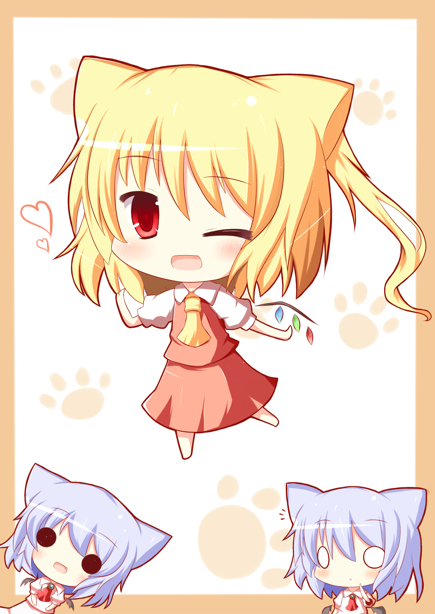

# 作品集

*最后更新：{docsify-updated}*

此处展示喵窝官方标志作品，以及玩家们以喵窝为基础制作的衍生作品。

### NyaaCat's Logo
  
「ぬこみみ」  
Art by gaiusu24 ([twitter](https://twitter.com/gaiusu24)) | ©NyaaCat Community

原图：[[ニコニコ静画](https://seiga.nicovideo.jp/seiga/im2423615)] [[pixiv](https://www.pixiv.net/artworks/30161440)]

.png)  
「ぬこみみ(Avatar ver.)」  
Art by Φ | ©NyaaCat Community

### 官方渲染照片

?> :camera: 目前皆在[这里](https://downloads.nyaacat.com/images/)托管。原图非常大，下载可能较慢。

| 照片文件 | 内容 |
|-|-|
| birdcage1.20200820.8k.png | *（暂未开放的区域）* |
| chunky-east2.100000spp-4k.png | 一行人在 AQUA'S 的风水商桥上嬉戏 |
| eastcity1-20180820.8k.PNG | AQUA'S 海星城全景 |
| kedama1-rev2.20181225.8K.png | 众人齐聚「毛玉线圈物语」V2毛运村 |
| kedama1-rev1.20180826.8K.png | *（上图的早期版本）* |
| kedama1.20180822.8K.png | *（上图的更早期版本）* |
| machi1-rev1.8K.20180825.png | 万华街，人流熙熙攘攘 |
| machi1.20180821.8K.png | *（上图的早期版本）* |
| north-brookland1.20200820.4ki.png | 一行人正在邮轮上眺望北溪台 |
| spawn1.20180820.8K.png | 一人躲在旧「新手洞穴」内 |
| westcity1-20180820.8K.png | 一人踱步于柚木小镇街上 |

### 玩家衍生作品

（TBC）

<!-- 注意！除官方版权作品以外，不建议直接向本 Wiki 的 Git 仓库保存作品（仓库空间有限）。尽量多地使用外链。-->