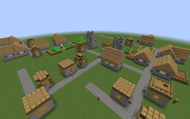
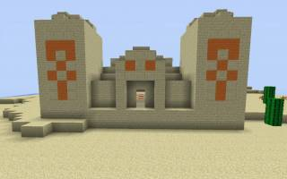
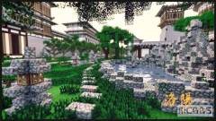
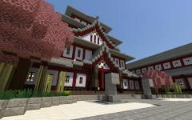
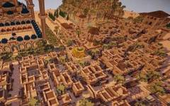
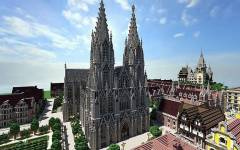
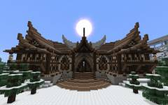
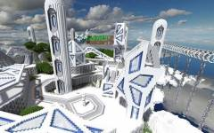
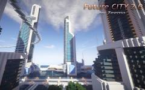

# Minecraft 建筑基础与技巧

本页面收集喵窝建筑规范文件，以及《Minecraft》的各种建筑基础知识、结构学和建筑技巧。请访问相应页面浏览。
- [Minecraft 建筑入门](tutorial/building/minecraft-building.md)  
- [喵窝建筑要求](tutorial/building/nyaacat-contruction-requirements.md)
- [轨道工程建设标准与规范](tutorial/building/railway-construction-standard.md)

## 建筑风格

### [Minecraft 原生建筑](tutorial/building/minecraft-building.md)  
最典型的代表是 Minecraft 自动生成的建筑。其外观朴素，材质简单容易获取，适合在生存模式下建造。这类建筑一般在保持基本建筑结构合理的前提下，以游戏实用性为主（比如用石砖建房子可以有效减轻爬行者的爆炸对房屋造成的损害）。   
  

### [东亚建筑](tutorial/building/tutorial-eastern-style.md)
东亚建筑主要是指中国和日本两个国家古代的建筑风格。它们以木质结构为主，在悠长的历史中，中式建筑和日式建筑各自形成非常庞大的体系。不同派系的有着不同的结构、风格和意义。但是相同的是，东亚建筑都极其注重结构的合理性，部分建筑甚至会通过外露柱梁强调结构美。

**中式建筑（中国风）：** 
主要指的是中国古代的建筑，宫殿类的建筑以复杂的柱梁结构，奢华大气的外观为主要风格，最显著的特征是飞檐、斗拱、雕花等。而民居方面，以四合院，园林建筑，徽派建筑等强调实用性和自然观赏性为主。   
    

**日式建筑（和风）：**
和中式建筑在结构上相似，日式建筑外观细节较为
简朴，屋顶上常有破风等结构。 Minecraft 中神社和日本城是玩家经常建造的建筑。  
    

### [欧洲建筑教程](tutorial/building/tutorial-medieval.md)
Minecraft 中欧洲建筑主要指的是欧洲中世纪建筑风格，这也是国外 Minecraft 建筑玩家非常热衷的一个建筑风格。这种建筑风格的代表性建筑从整体形状上来看是上大下小的，公共建筑常带有塔楼或钟楼等结构。民居的特点则是坡度较大的木制斜屋顶。使用大量使用石头类材质做外墙和承重，内部结构（横梁，地板等）依然以木质为主。  
 
    
**哥特式（西欧）：**
比起圆润的古罗马建筑，高、细、尖是哥特式建筑的主要特点，建筑正面一般有双塔。其次，哥特式大型建筑常会有离开主体的立柱，通过斜梁与主体相连，这种结构叫做飞扶壁（buttress）。  
    

**维京式**
维京泛指北欧海盗，他们的建筑也有非常显著的飞檐（一般弧度大于东亚的飞檐）。    
    

**中东建筑**
中东地带气候干燥少雨，所以他们的建筑以平顶居多，主要建材是沙石。其中拜占庭风格的圆顶建筑，特点是中心位置常有巨大的半圆穹顶，圆顶下方为四个半圆门拱，门拱交接的地方由四条巨大石柱支撑起整个穹顶压力。另外还有阿拉伯的清真建筑，大多数呈方形结构，除主体建筑祈祷厅外还套这一个露天庭院。   
      

### 现代建筑
由于结构科学的形成以及技术带来建筑材料的发展，现代建筑变得非常广泛，从拔地而起的高楼大厦，到融合古风元素的庭院别墅，都属于现代建筑的范畴。  
  
  

### 幻想建筑
也可以称为未来建筑，这类建筑最主要的特征比现代建筑更加前卫，常见于各种科幻作品当中。  
     

## 其他建筑技巧
- [简单圆顶教程](tutorial/building/tutorial-dome.md)  
- [结构学入门](tutorial/building/architechture-introduction.md)

