# Minecraft 建筑入门

Minecraft 建筑入门

这个页面主要会介绍一些 Minecraft 建筑的入门常识。当然如果你是建筑老手，也可以选择参考各种建筑风格的[高级建造教程](tutorial/building/building-style)。

### 一般尺寸

> Minecraft 里人的高度是2格，所以我们的建筑高度，每一层一般控制在4格左右的高度。如果高度太矮，会有一种压抑感；太高又会有一种莫名的空虚感。同时房屋的面积大小也值得注意。生存模式下，为了宽敞，常常会把一个房间造得非常大，但是这种做法是非常不合理的。首先，单个房间过大势必会造成天花板变矮的假象；其次很多玩家在建造大房间的时候，为了视线宽敞，便会省略支撑天花板的立柱，造成违背结构力学（天花板会塌陷的啦）。一般而言一个房间的面积应该控制在20\~40格左右。除了单层高度，房间面积，单面墙体的宽度也值得注意，具体来说，控制在3\~7格的宽度比较合适。在一般情况下，单面墙体宽度过长就如同单个房间面积过大一样，是一种不合理的设计（现实生活中这样的墙体容易侧到）。 

前面说的都是废话，凭感觉建就好，别太离谱。

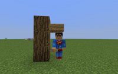    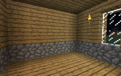    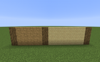

除了上面介绍的三个值得注意的尺寸外，Minecraft 中的地板高度也值得注意（见下图）。Minecraft 建筑中下半阶地板的使用比较少（会造成物品悬空）

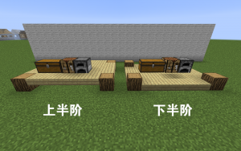

### 房屋的骨架

参见《[结构学入门](tutorial/building/architechture-introduction)》

### 屋顶

屋顶可以说是建筑的门面，有时候不同风格的建筑区别就在于屋顶上面。建造屋顶的时候要准确把握屋顶的曲线。下面介绍三种基本的屋顶。

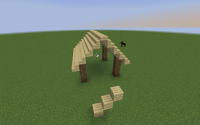    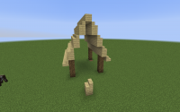    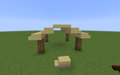

屋顶基本型的简单组合

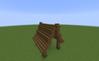

另请参见：[简单圆顶教程](tutorial/building/tutorial-dome)

### 柱子

(WIP)

### 墙体

Minecraft 建筑中骨架，屋顶和墙体三者构成一栋建筑的基本轮廓。下面提供一些墙体设计的基本建造思路。

一般的墙体，主要设计要点在于材质的选择和搭配，以及墙体细节的刻画上。

不同的材质有不同的效果，常用的墙体材质有木板、羊毛、石头、彩色粘土等。

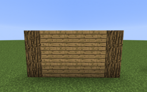    

通过为墙体添加适当的细节，实现建筑的多样化和精细化。

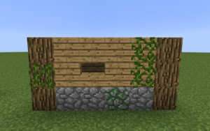    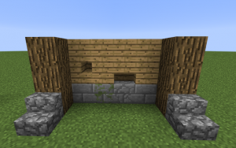

### 内部装饰

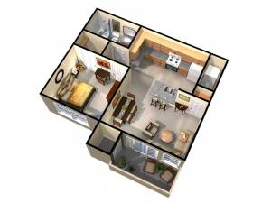    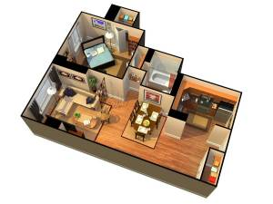    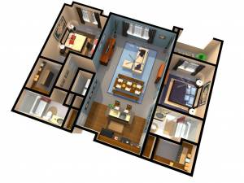

### 配色

一般来说，地板的颜色比墙壁的颜色深，墙壁可以和天花板同色。

### 布局

- 一栋住宅：客厅，厨房，餐厅，卫生间，卧室，书房，花园，储物间
- 一个城市：中心建筑（在多中心的城市中可以有多个），住宅区，商业区，工业区，道路，公共设施（公园，学校，医院，港口等）

上面的分类偏现代，在不同时代，不同风格的情况之下，布局也会有所变化。澄清一点，大型建筑是指建筑的规模很大。

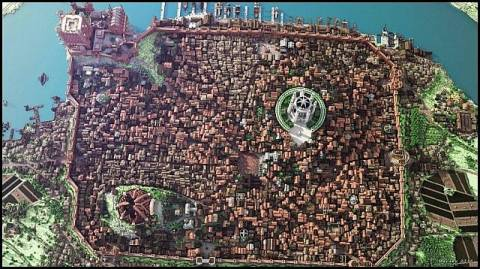

Minecraft 下的君临城

### 曲线

作为一名合格的 Minecraft 建筑师，徒手撸圆是必备技能之一，下面提供撸圆神器：

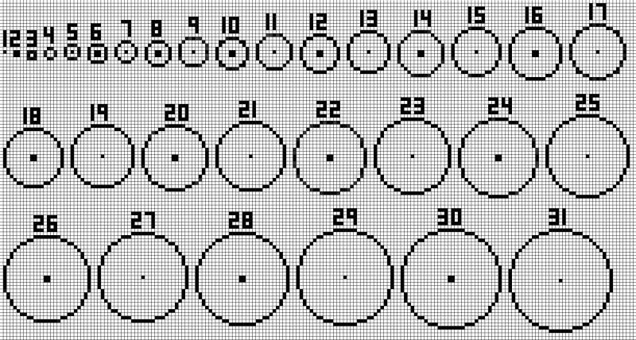

### 常见问题

- 反重力
- 反自然
- 布局过大
- 缺失细节
- 不和谐

相关讨论请参考玩家bitdancer在喵窝论坛的[讨论帖](https://bbs.nyaa.cat/topic/95/%E4%BD%9C%E4%B8%BA%E4%B8%80%E4%B8%AA%E4%B8%9A%E4%BD%99mc%E5%BB%BA%E7%AD%91%E5%B8%88%E5%AF%B9%E5%96%B5%E6%9C%8D%E7%9A%84%E5%BB%BA%E7%AD%91%E8%AF%84%E4%BB%B7) [1]

### 建筑进阶

这篇教程旨在给 Minecraft 建筑初学者提供一个整体概念的描绘，如果你想在 Minecraft 建筑上做得更好，关键是要留心现实中的建筑和别人优秀的建筑作品，多多实践，不要不好意思模仿。

----

[1]: 由于 NodeBB 版论坛 [关闭](changelogs/2016?id=2016-02-08-新论坛上线及创造组-worldedit-schematics-命名规则更新)，本链接暂不可用
