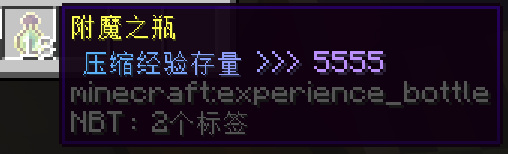

# Ukit 插件指南

!> :construction: **UKit 插件采用敏捷开发模式，功能持续更新进化中。**

UKit 包含了服务于玩家的一些辅助功能，以方便生活、展示自我。  
如无特殊说明，以下功能皆可免费使用。

如需反馈问题，或希望参与开发、翻译、整理文档等，请戳 [GitHub 页面](https://github.com/NyaaCat/Ukit)。

## 装扮相关

### 多彩文字 :id=format
*Minecraft* 原生支持 16 种文字色彩和粗体、下划线等样式；但在原版，除告示牌外，必须搭配难以输入的字符 `§` 方可使用彩色。而在喵窝，**只需使用 `&` 即可。**  
除预先提供的 16 种颜色以外，**还可以使用 RGB 彩色文本。**其格式化代码为 `&` 紧跟 HTML 表记的颜色代码，如 `&#66ccff好喝的水`；暂不支持简写颜色代码。

可以在聊天栏，以及本插件所有命名功能（前后缀、物品重命名、预编辑告示牌）等处使用多彩文字。  
在执行下列各种命名类命令前，可用命令 `/echo [文本内容]` 进行测试，以免浪费现金；通过该命令发送的测试内容，不会被别人看到。

* [格式化代码介绍](https://zh.minecraft.wiki/%E6%A0%BC%E5%BC%8F%E5%8C%96%E4%BB%A3%E7%A0%81)（[内地镜像](https://wiki.biligame.com/mc/%E6%A0%BC%E5%BC%8F%E5%8C%96%E4%BB%A3%E7%A0%81)）
* [RGB 调色板](https://www.matools.com/color)
* [彩虹渐变文本生成器](https://patorjk.com/text-color-fader/)（[使用说明<sup>（Internet Archive）</sup>](https://web.archive.org/web/20200926063018/https://bbs.nyaa.cat/d/1762-1162)）

!> 大量使用 RGB 彩色文本可能会导致你的消息/命令字数长度迅速达到上限（256 个字符）。

!> 黑色字 `&0` 在聊天栏中会被展示为白色。

### 更改前后缀、昵称 :id=chat-prefix-suffix

可以修改在游戏内的昵称（取代游戏 ID 显示，但不影响之），或者前后缀。建议包含可方便认识你的中文昵称。  
请勿使用过长或有不良内容或假冒他人之文字！

| 目的 | 命令 | 费用 |
| - | - | - |
| 设置/修改前缀 | `/u chat prefix set [前缀]` | 198 卷 + 100 经验/次 |
| 重置（清空）前缀 | `/u chat prefix remove` | 免费 |
| 设置/修改后缀 | `/u chat suffix set [后缀]` | 99 卷 + 100 经验/次 |
| 重置（清空）后缀 | `/u chat suffix remove` | 免费 |
| 自定义昵称 | `/nick` | 免费 |
| 清除自定义昵称 | `/nick off` | 免费 |

<details>
<summary>🎨<span class="nw-important">希望使用空格、多彩文字？</span></summary>

文本可使用空格，可直接输入，无需半角反引号 ``` ` ```。  
文本支持[多彩文字](#format)。

示例：

```
/u chat prefix set &4柠檬 &6果酱蛋糕
```
</details>


## 物品相关

### 邮箱功能 :id=mailer

| 目的 | 命令 | 费用 |
| - | - | - |
|设置邮箱|`/u mail box set`|10 卷
|取消设置邮箱|`/u mail box clear`|免费
|获取邮箱位置|`/u mail box info`|免费
|发送邮件|`/u mail sendto <玩家ID>`|见下文

玩家可使用邮箱功能，向指定玩家的邮箱投送物品。

使用设置邮箱功能时，输入 `/u mail box set` 指令后，玩家需要在 10 秒以内单击一个容器（如箱子或木桶），即可指定该容器作为邮箱，设置费用为 10 卷。余额不足时，设置不会成功。

<details>
<summary>📦<span>有哪些容器可以被指定为邮箱？</span></summary>

截至本条目编辑时，以下物品因具备容器属性，可作为邮箱使用：木桶、高炉、酿造台、箱子、合成台、发射器、投掷器、熔炉、漏斗、烟熏炉。（潜影盒不能作为邮箱使用）

不过，由于栏位有限、可能出现不可预料的动作、未来版本更新可能不再属于容器等原因，不建议将除`箱子`和`木桶`之外的容器设置为邮箱。
</details>

设置邮箱后，可使用 `/u mail box info` 查询已设置邮箱的位置。

使用 `/u mail box clear` 删除已设置的邮箱。（重新指定邮箱位置`不需要`先删除已有邮箱）

向其他玩家发送邮件前，将待发送的物品拿在主手中，然后使用 `/u mail sendto <玩家ID>` 将邮件发出。

发送单格物品（潜影盒除外）为 1 卷/次（不限数量，发送 1 个物品和发送 1 组物品的费用是相同的），发送潜影盒则为 18 卷/次。

### 物品展示

#### 在手中 :id=show

展示手中的物品：`/u show`。

执行后，展示行为会广播给全服玩家，包括自己；将鼠标移至聊天栏中的该物品名称上，可观看其信息（包括耐久、Lore 等 NBT 标签，但外形不可见）。

被展示的物品信息不会更新。

#### 在展示框中 :id=lock

可以将物品放入展示框中，并使用 Ukit 的展示框保护功能，以保护展示框不被破坏。玩家右键被保护的展示框，可在聊天栏中观看物品的 NBT 信息。

如果展示的是**成书**，右键则直接观看其内容。

按住 Shift 右键点击展示框，可旋转展示框中的物品，无论操作者是否为上锁展示框所有者本人。

如需了解某展示框是否被保护、由何人所有，可对准其执行命令 `/u lock info`。

无论对此展示框如何操作——包括通过破坏其挂靠的方块令其掉落，也不能获得展示的物品。

?> :heavy_check_mark: **设置和取消方法**

1. 放置一个展示框。
1. 把物品置入展示框。
1. 对准展示框，执行 `/u lock setup`。
1. 物品会退还给你，设置完成。
  - 还可设定其是否透明或发光——只需对准其再执行 `/u lock property` ，按提示切换开关即可。
- 取消展示时，对准该展示框执行 `/u lock remove`。（由于数据存储原理不同，该操作暂不支持 1.18 更新以前使用 NyaaUtils 设置的上锁展示框。）


### 物品重命名 :id=item-rename

使用 `/u item rename [名称]` 可以重命名手中的物品，例如 `/u item rename &7&l好喝的水`。价格为 10 卷 / 个。  
注意：**重命名是针对单个物品收费**；也即，重命名一整组（64个）物品需花费 640 卷。
  
<details>
<summary>🎨<span class="nw-important">希望使用空格、多彩文字？</span></summary>

文本可使用空格，可直接输入，无需半角反引号 ``` ` ```。  
文本支持[多彩文字](#format)。

示例：

```
/u item rename &4柠檬 &6果酱蛋糕
```
</details>

## 战斗/装备相关

### 经验胶囊 :id=xp

现在，附魔之瓶（俗称“经验瓶”）可以存储更多经验值了，并可自由取出或交易。玩家不再担心身上的 200 级经验瞬间灰飞烟灭了。  
~~如果不慎~~ 在潜行状态下打碎瓶子，所储存的经验**全部转化为经验球返还**。

  
<small>存储有经验的经验胶囊。</small>

?> :game_die: 操作方法

* 存储经验
  1. 拿着[附魔之瓶](https://zh.minecraft.wiki/%E9%99%84%E9%AD%94%E4%B9%8B%E7%93%B6)**（原版物品）**
  2. 执行命令 `/u xp store [经验值]`
* 恢复经验（可以修补装备）  
  手持压缩经验瓶
  - 使用命令 `/u xp take [经验值]`
  - 在非潜行状态按两次使用/放置键快速提取经验，默认取出压缩经验瓶存量的 1% 或至少 10 点经验，取出的经验将在当前位置成为经验实体  
  使用命令 `/u xp quicktake [经验值]` 自定义每次快速提取的经验值
  - 在潜行状态按使用/放置键丢出压缩经验瓶，破碎时释放所有压缩经验

经验瓶可提供所存经验值的预览，在键入命令时，亦可按下 Tab 键补全经验值（最大可转移的数目）。

!> 注意事项

* ~~单个经验胶囊最多可以存储 1048576 点经验。~~（待验证）
* 存储有相同数量的经验胶囊**可以堆叠**。堆叠时使用命令，可以从每个瓶子中平均取出/存入经验。
* 如果经验胶囊中的所有经验被取出，其经验胶囊形态将会保留。此时压缩经验存量显示 `0`。
* **2021 年 10 月 23 日前启用的所有经验瓶，现已失效。** ~~请小心保管，等待后续补偿。~~

### 自动飞行

在主手持刷子进入鞘翅飞行状态时会出现速度指示，在速度过低时会自动燃放背包中的烟花火箭维持飞行，按住潜行可以停止自动燃放。

## 其他功能

### 编辑告示牌 :id=signedit

普通玩家可先放置告示牌，对准其键入命令

`/u signedit [行数] [内容]`

其中，“行数”介乎 1\~4；“内容”指定该行内容。执行后，牌上可见以此法编辑的文字。

**小贴士：**

- 此命令可最大化利用告示牌空间，**尤其多彩文字代码较多的情况下**。
- 告示牌的既有内容也可编辑噢。
- 已有特殊功能的牌子（如箱子锁、商店牌子等）不可以此法编辑内容。应通过各自对应的指令编辑之。

<details>
<summary>🎨<span class="nw-important">希望使用空格、多彩文字？</span></summary>

文本可使用空格，可直接输入，无需半角反引号 ``` ` ```。  
文本支持[多彩文字](#format)。

示例：

```
/u signedit 1 &4柠檬 &6果酱蛋糕
```
</details>

### 席地而坐 :id=sit

主手留空，指向特定方块并右键，若其上为空气，可于其上坐下。  
通过命令  `/u sit` 开启或关闭该功能。

已知毛毯、床（在白天时）、各种半砖（即台阶）、各种楼梯皆可坐下。  
若在坐上后破坏它们，则人不会离开，而继续维持坐姿，形如“浮空”。~~一键炼成斗宗强者~~

### 发红包 :id=redbag

使用 `/u redbag create [fixed|lucky] [金额] [数目] [口令]` 派发一次红包。

- fixed 为固定金额红包，金额部分识别为单个金额
- lucky 为拼手气红包，金额部分识别为总金额
- 口令可选，请遵守一般聊天规则设置密码

### 离线消息推送 :id=news

离线或处于挂机状态（afk）时收到的消息会暂存到离线消息服务，同时在上线或退出挂机状态时显示提醒。  
使用 `/u news` 接收所有未读消息。

当前 [天喵商城](/tutorial/plugins/hmarket?id=hm)、[邮箱服务](#mailer) 和 [喵店](/tutorial/plugins/nyaashop.md?id=shop) 支持此功能。