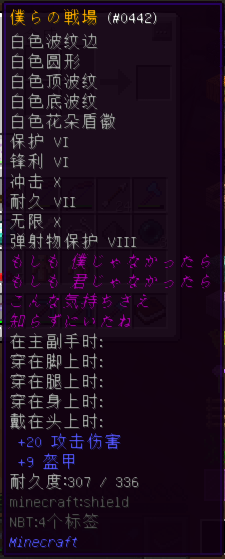

# 推荐资源（旧版本）

?> :heavy_check_mark: **主条目：**[推荐资源](wiki/resources)

这里存放已经不适用于目前喵窝 / 毛线所需版本的旧版推荐资源。

## 原版整合包（客户端）

### Minecraft 1.20.1

?> :heart: 【2023.06.23 更新】**Minecraft 1.20.1 简单整合** *by BlingWang*

提供可被 MultiMC 导入的 Mod 包。

[原帖与下载地址](https://community.craft.moe/d/3934)

默认包含模组

[Moddermore 列表](https://moddermore.net/list/VAJaICLWh_k8)

- ['Slight' Gui Modifications](https://curseforge.com/minecraft/mc-mods/slight-gui-modifications) - Allows 'slight' gui modifications
- [3D Skin Layers](https://modrinth.com/mod/3dskinlayers) - Render the player skin layer in 3d!
- [AdvancementInfo](https://modrinth.com/mod/advancementinfo) - Show more information about advancement requirements
- [AppleSkin](https://modrinth.com/mod/appleskin) - Food/hunger-related HUD improvements
- [Architectury API](https://modrinth.com/mod/architectury-api) - An intermediary api aimed to ease developing multiplatform mods.
- [Auth Me](https://modrinth.com/mod/auth-me) - Authenticate yourself and re-validate your session
- [Better Ping Display [Fabric]](https://modrinth.com/mod/better-ping-display-fabric) - Adds a configurable numerical ping display to the player list
- [BetterF3](https://modrinth.com/mod/betterf3) - BetterF3 is a mod that replaces Minecraft's original debug HUD with a highly customizable, more human-readable HUD.
- [Boat Item View](https://modrinth.com/mod/boat-item-view) - See your held items when in a moving boat!
- [Bobby](https://modrinth.com/mod/bobby) - Allows for render distances greater than the server's view-distance
- [Capes](https://modrinth.com/mod/capes) - Lets you use capes from OptiFine, LabyMod and other cape mods
- [Cloth Config API](https://modrinth.com/mod/cloth-config) - Configuration Library for Minecraft Mods
- [Concurrent Chunk Management Engine (Fabric)](https://modrinth.com/mod/c2me-fabric) - A Fabric mod designed to improve the chunk performance of Minecraft.
- [Continuity](https://modrinth.com/mod/continuity) - A Fabric mod that allows for efficient connected textures
- [Controlling](https://modrinth.com/mod/controlling) - Adds a search bar to the Key-Bindings menu
- [Dark Loading Screen](https://modrinth.com/mod/dark-loading-screen) - Makes the loading screen darker.
- [Debugify](https://modrinth.com/mod/debugify) - Fixes Minecraft bugs found on the bug tracker
- [Dynamic FPS](https://modrinth.com/mod/dynamic-fps) - Reduce resource usage while Minecraft is in the background or idle.
- [Entity Culling](https://modrinth.com/mod/entityculling) - Using async path-tracing to hide Block-/Entities that are not visible
- [Forge Config API Port](https://modrinth.com/mod/forge-config-api-port) - NeoForge's & Forge's config systems provided to other modding ecosystems. Designed for a multiloader architecture.
- [Gamma Utils (Fullbright)](https://modrinth.com/mod/gamma-utils) - Gamma / Brightness / Night Vision mod, making it easy to see in the dark. Basically Fullbright for Fabric.
- [IBE Editor](https://modrinth.com/mod/ibe-editor) - Simple GUI Mod to edit an item, a block or an entity in your current world
- [IMBlockerFabric](https://modrinth.com/mod/imblocker) - IMBlockerFabric is a mod that It can Hide IM(InputMethod) when you don't need to input text! This mod fixes the typing bug exist in Minecraft which annoying Asian players for a long time.
- [ImmediatelyFast](https://modrinth.com/mod/immediatelyfast) - Speed up immediate mode rendering in Minecraft
- [Indium](https://modrinth.com/mod/indium) - Sodium addon providing support for the Fabric Rendering API, based on Indigo
- [Inspecio](https://modrinth.com/mod/inspecio) - A Minecraft mod which adds more tooltips.
- [Interactic](https://modrinth.com/mod/interactic) - Refined item interactions
- [Inventory Profiles Next](https://modrinth.com/mod/inventory-profiles-next) - Take control over you inventory. Sort. Move matching Items. Throw all. Locked slots. Gear sets! And much more.
- [Iris Shaders](https://modrinth.com/mod/iris) - A modern shaders mod for Minecraft intended to be compatible with existing OptiFine shader packs
- [ItemSwapper](https://modrinth.com/mod/itemswapper) - Inventory update concept for hotswapping items.
- [Krypton](https://modrinth.com/mod/krypton) - A mod to optimize the Minecraft networking stack
- [LAN World Plug-n-Play (mcwifipnp)](https://modrinth.com/mod/mcwifipnp) - LAN World Plug-n-Play (mcwifipnp)
- [LambDynamicLights](https://modrinth.com/mod/lambdynamiclights) - A dynamic lights mod for Fabric.
- [LambdaBetterGrass](https://modrinth.com/mod/lambdabettergrass) - A Minecraft mod which adds better grass and snow to the game.
- [Language Reload](https://modrinth.com/mod/language-reload) - Reduces load times and adds fallbacks for languages
- [LazyDFU](https://modrinth.com/mod/lazydfu) - Makes the game boot faster by deferring non-essential initialization
- [Litematica](https://curseforge.com/minecraft/mc-mods/litematica) - A modern schematic mod written for Fabric (and LiteLoader on 1.12.x), with extra features for Creative mode work
- [Lithium](https://modrinth.com/mod/lithium) - No-compromises game logic/server optimization mod
- [MaLiLib](https://curseforge.com/minecraft/mc-mods/malilib) - A library mod required for masa's client-side mods
- [Memory Leak Fix](https://modrinth.com/mod/memoryleakfix) - A mod that fixes random memory leaks for both the client and server
- [MidnightControls](https://modrinth.com/mod/midnightcontrols) - Adds controller support and enhanced controls overall.
- [MidnightLib](https://modrinth.com/mod/midnightlib) - Common library with a built-in configuration system
- [MixinTrace](https://modrinth.com/mod/mixintrace) - Adds a list of mixins in the stack trace to crash reports 
- [Mod Menu](https://modrinth.com/mod/modmenu) - Adds a mod menu to view the list of mods you have installed.
- [More Chat History](https://modrinth.com/mod/morechathistory) - Increases the maximum length of chat history.
- [More Culling](https://modrinth.com/mod/moreculling) - A mod that changes how multiple types of culling are handled in order to improve performance
- [No Chat Reports](https://modrinth.com/mod/no-chat-reports) - Makes chat unreportable (where possible)
- [Ok Zoomer](https://modrinth.com/mod/ok-zoomer) - Adds a highly-configurable zoom key for Quilt. The zoom is yours!
- [OptiGUI](https://modrinth.com/mod/optigui) - Blazing fast custom GUI textures on Fabric and Quilt with built-in OptiFine custom GUI resource pack support
- [Pick Block Pro](https://modrinth.com/mod/pick-block-pro) - An advanced client side Block, Entity, NBT, Tool and ID picker
- [Quilt Kotlin Libraries (QKL)](https://modrinth.com/mod/qkl) - Quilt's official Kotlin libraries
- [Quilted Fabric API (QFAPI) / Quilt Standard Libraries (QSL)](https://modrinth.com/mod/qsl) - The standard libraries of the Quilt ecosystem. Essential for your modding experience on Quilt!
- [Reese's Sodium Options](https://modrinth.com/mod/reeses-sodium-options) - Alternative Options Menu for Sodium
- [Roughly Enough Items (REI)](https://modrinth.com/mod/rei) - Clean and Customizable. Alternative to Just Enough Items/JEI.
- [Screenshot to Clipboard](https://modrinth.com/mod/screenshot-to-clipboard) - Screenshots taken are copied to the clipboard.
- [Searchables](https://modrinth.com/mod/searchables) - Searchables is a library mod that adds helper methods that allow for searching and filtering elements based on components, as well as offering built in auto-complete functionality.
- [Sodium](https://modrinth.com/mod/sodium) - A modern rendering engine for Minecraft which greatly improves performance
- [Sodium Extra](https://modrinth.com/mod/sodium-extra) - A Sodium addon that adds features that shouldn't be in Sodium.
- [SomeOrdinaryTweaks](https://modrinth.com/mod/ordinarytweaks) - Completely client-sided mod that offers various toggle-able QOL changes and tweaks (GUI, Game/World Interaction)
- [Starlight (Fabric)](https://modrinth.com/mod/starlight) - Rewrites the light engine to fix lighting performance and lighting errors
- [Stendhal](https://modrinth.com/mod/stendhal) - Stendhal is a client-side Fabric mod offering new and enhanced visual utilities for books, signs, anvil and the in-game chat.
- [Tweakeroo](https://curseforge.com/minecraft/mc-mods/tweakeroo) - Various client-side tweaks, such as hand restock, hotbar swap/cycle, flexible/fast block placement etc.
- [Very Many Players (Fabric)](https://modrinth.com/mod/vmp-fabric) - A Fabric mod designed to improve server performance at high playercounts.
- [ViaFabric](https://modrinth.com/mod/viafabric) - Allows to connect to older servers with older versions
- [WTHIT](https://modrinth.com/mod/wthit) - What the hell is that?
- [Xaero's Minimap](https://modrinth.com/mod/xaeros-minimap) - Displays a map of the nearby world terrain, players, mobs, entities in the corner of your screen. Lets you create waypoints which help you find the locations you've marked.
- [Xaero's World Map](https://modrinth.com/mod/xaeros-world-map) - Adds a full screen world map which shows you what you have explored in the world. Works great together with Xaero's Minimap.
- [Your Options Shall Be Respected (YOSBR)](https://modrinth.com/mod/yosbr) - Your options shall be respected.
- [[ETF] Entity Texture Features](https://modrinth.com/mod/entitytexturefeatures) - Emissive, Random & Custom texture support for entities in resourcepacks just like Optifine but for Fabric
- [bad packets](https://modrinth.com/mod/badpackets) - Bad Packets allows packet messaging between different modding platforms.
- [lazy-language-loader](https://modrinth.com/mod/lazy-language-loader) - lazy-language-loader improves loading times when changing your language by only reloading the language instead of all the game resources!
- [libIPN](https://modrinth.com/mod/libipn) - Inventory Profiles Next GUI/Config library
- [oωo (owo-lib)](https://modrinth.com/mod/owo-lib) - A general utility, GUI and config library for modding on Fabric and Quilt

### Minecraft 1.18.2

?> :heart: 【2022.11.06 更新】**Minecraft 1.18.2 简单整合** *by BlingWang*

提供可被 MultiMC 导入的 Mod 包。

[原帖与下载地址](https://community.craft.moe/d/2735/24)

默认包含模组

- [光影核心] iris
- [光照优化] starlight
- [内存优化] ferritecore
- **模组前置**
  - architectury
  - badpackets
  - cloth-api
  - cloth-config
  - completeconfig
  - DarkKore
  - fabric-language-kotlin
  - ForgeConfigAPIPort
  - Iceberg
  - malilib
  - qfapi
- **功能增强**
  - [信息显示] KronHUD
  - [REI] RoughlyEnoughItems
  - [REI 中文搜索] roughly-enough-characters
  - [主菜单信息] main-menu-credits
  - [乘船查看物品] Boat-Item-View
  - [划船 GUI] boathud
  - [创世神] worldedit
  - [创世神 CUI] WorldEditCUI
  - [功能调整] some-ordinary-tweaks
  - [动态 FPS] dynamic-fps
  - [万能工具] tweakeroo
  - [取物增强] inventorytabs
  - [局域网联机增强] mcwifipnp
  - [R 键整理] InventoryProfilesNext
  - [截图到剪贴板] screenshotcopy
  - [手持信息] held-item-info
  - [手柄控制] midnightcontrols
  - [What The Hell Is That] wthit
  - [方块状态复制] Pick-Block-Pro
  - [方块轮廓] BetterBlockOutline
  - [小地图] journeymap
  - [无缝加载] seamless-loading-screen
  - [更好 F3] BetterF3
  - [更好 Ping 显示] BetterPingDisplay
  - [游戏内重登账号] authme
  - [物品交互] interactic
  - [物品属性] inspecio
  - [物品排序] reasonable-sorting
  - [批量移动] itemscroller
  - [物品编辑器] IBEEditor
  - [鼠标功能扩展] MouseTweaks
  - [盔甲栏细节] DetailArmorBar
  - [系统任务栏] bettertaskbar
  - [缩放] ok-zommer
  - [聊天记录保留] morechathistory
  - [职业标记] MerchantMarkers
  - [自定义启动界面] customsplashscreen
  - [装备对比] EquipmentCompare
  - [超视距渲染] bobby
  - [阻止崩溃] notenoughcrashes
  - [降级连接] viafabric
  - [高亮新物品] Highlighter
  - [高清截图] fabrishot
  - [高级字符] stendhal
- **启动优化**
  - lazydfu
  - smoothboot
- **材质优化**
  - [动态光源] lambdynamiclights
  - [斗篷兼容] Capes
  - [自定义 GUI] optigui
- **材质增强**
  - [3D 皮肤] 3dskinlayers
  - [动态材质] animatica
  - [实体材质] entity-texture-features
  - [纹理连接] continuity
  - [群系颜色] colormatic
  - [自定义模型] cem
  - [草地优化] lambdabettergrass
- **渲染优化**
  - [GUI] exordium
  - [实体] entityculling
  - [实体] moreculling
  - [方块] enhancedblockentities
  - [树叶] cullleaves
  - sodium
  - sodium-extra
  - indium
- [玩家优化] vmp
- [网络优化] krypton
- **菜单增强**
  - [GUI 优化] slight-gui-modifications
  - [键位设置] Controlling
  - [模组列表] modmenu
  - [模组配置] puzzle
  - [资源包选择] DraggableResourcePacks
  - [进度详情] advancementinfo
  - [渲染优化选项] reeses-sodium-options
- **语言切换优化**
  - language-reload
  - lazy-language-loader
- **通用优化**
  - [C2ME] c2me
  - [配置文件] yosbr
  - lithium
- **错误修复**
  - debugify
  - TieFix
  - [内存] memoryleakfix
  - [反幽灵方块] antighost
  - [模型] item-model-fix
  - [输入法冲突修复] imblocker
- **高级聊天**
  - [HUD] AdvancedChatHUD
  - [宏] AdvancedChatMacros
  - [拼写增强] AdvancedChatBox
  - [文本过滤] AdvancedChatFilters
  - [核心] AdvancedChatCore

默认包含资源包

- [汉化包] BetterBlockOutline
- [汉化包] MASA (tweakeroo, minihud, malilib, litematica, itemscroller)
- [深色界面] Default-Dark-Mode
- Xekr 原版红石显示 & 漏斗投掷器附加

默认包含光影包

- BSL
- Chocapic13 (Low)

### Minecraft 1.17.1

?> :heart: 【2021.10.24 更新】**Minecraft 1.17.1 简单整合** *by BlingWang*

提供包含启动器的独立整合包，亦提供可直接被 MultiMC 导入的 Mod 包。

[原帖与下载地址](https://community.craft.moe/d/2553-minecraft-1171)

默认包含模组

- [Cloth Config API] cloth-config
- [Fabric 核心] fabric-api
- [NBT 信息] nbttooltip
- [REI] RoughlyEnoughItems
- [What The Hell Is That] wthit
- [创世神] worldedit
- [距离度量] blockmeter
- [反幽灵方块] antighost
- [附魔描述] EnchantmentDescriptions
- [批量交易] easiervillagertrading
- [键位设置] Controlling
- lithium
- [录像回放] replaymod
- [信息显示] minihud
- [模组列表] modmenu
- [渲染优化扩展] sodium-extra
- [渲染优化] sodium
- [耐久显示] durabilityviewer
- [批量移动] itemscroller
- [饥饿显示] appleskin
- [模组前置] architectury
- [模组前置] malilib
- [潜影盒内容显示] shulkerboxtooltip
- [游戏内重登账号] authme
- [深色加载界面] dark-loading-screen
- [输入法冲突修复] imblocker
- [鼠标功能扩展] MouseTweaks
- [小地图] VoxelMap
- [方块投影] litematica
- [万能工具] tweakeroo
- [R 键整理] InventoryProfilesNext
- [游戏进入提醒] pling
- [自动重连] AutoReconnector
- [自然结构轮廓] BBOutlineReloaded

?> :blue_heart: 【2021.08.22 更新】**Fabric 简单整合**  *by Atom202SLL*

可直接被 MultiMC 导入。

[原帖与下载地址](https://community.craft.moe/d/2079/20)

默认包含模组

- appleskin
- architectury
- cloth-config
- easiervillagertrading
- fabric-api
- fast-chest
- InventoryHUD
- InventoryProfilesNext
- litematica
- malilib
- minihud
- modmenu
- optifabric
- preview_OptiFine
- replaymod
- RoughlyEnoughItems
- shulkerboxtooltip
- tweakeroo
- VoxelMap
- worldedit
- wthit

未启用模组

- iris
- sodium

### Minecraft 1.16.5

?> :heart: 【2021.02.14 更新】**Minecraft 1.16.4 & 1.16.5 简单整合** *by BlingWang*

可直接被 MultiMC 导入。  

[原帖与下载地址](https://community.craft.moe/d/2182)

默认包含模组

- [Fabric 核心] fabric-api
- [信息显示] minihud
- [NBT 信息] nbttooltip
- [REI] RoughlyEnoughItems
- [R 键整理] inventoryprofiles
- [创世神 CUI] WorldEditCUI
- [创世神] worldedit
- [饥饿显示] appleskin
- [崩溃修复] SomeCrashFixes
- [彩色书籍] colorunchained
- [自动重连] autoreconnector
- [反幽灵方块] antighost
- [距离度量] blockmeter
- [方块信息] Hwyla
- [附魔描述] EnchantedToolTips
- [高清修复] OptiFine (preview)
- [高清修复前置] optifabric
- [键位设置] Controlling
- [自然结构轮廓] BBOutlineReloaded
- [计算优化] phosphor
- [录像回放] replaymod
- [模组列表] modmenu
- [耐久显示] durabilityviewer
- [批量交易] easiervillagertrading
- [批量移动] itemscroller
- [模组前置] malilib
- [潜影盒内容显示] shulkerboxtooltip
- [方块投影] litematica
- [小地图] VoxelMap
- [血量显示] orderly
- [游戏内重登账号] authme

?> :blue_heart: 【2021.01.21 更新】**Fabric 简单整合** *by Atom202SLL*

可直接被 MultiMC 导入。

[原帖与下载地址](https://community.craft.moe/d/2079-multimcminecraft-116-fabric/18)

默认包含模组

- [Appleskin](https://www.curseforge.com/minecraft/mc-mods/appleskin)
- [Durability Viewer](https://www.curseforge.com/minecraft/mc-mods/giselbaers-durability-viewer)
- [Fabric API](https://www.curseforge.com/minecraft/mc-mods/fabric-api)
- [Hwyla](https://www.curseforge.com/minecraft/mc-mods/hwyla)
- [Inventory Profiles](https://www.curseforge.com/minecraft/mc-mods/inventory-profiles)
- [MASA](https://masa.dy.fi/tmp/minecraft/mods/client_mods/)
- [Mod Menu](https://modrinth.com/mod/modmenu)
- [Optifabric](https://www.curseforge.com/minecraft/mc-mods/optifabric)
- [OptiFine](https://www.optifine.net/home)
- [Replaymod](https://www.replaymod.com/)
- [Roughly Enough Items](https://www.curseforge.com/minecraft/mc-mods/roughly-enough-items)
- [Shulker Box Tooltip](https://www.curseforge.com/minecraft/mc-mods/shulkerboxtooltip)
- [Voxelmap](https://www.curseforge.com/minecraft/mc-mods/voxelmap)
- [WorldEdit](https://www.curseforge.com/minecraft/mc-mods/worldedit)
- [WorldEditCUI](https://github.com/mikroskeem/WorldEditCUI)

### Minecraft 1.16.4

?> :heart: 【2020.11.30 更新】**Fabric 不完全整合/Auth Me/OptiFine/锂钠磷/投影 mod 教程** *by Kinomotomoyo*

需解压后手动添加到游戏。

[原帖与下载地址](https://community.craft.moe/d/1923-20201130minecraft-1164-fabric-auth-meoptifinemod)

默认包含模组

- [反幽灵方块] Antighost（快捷键 G 或者输入指令 /ghost）
- [饥饿显示] AppleSkin
- [游戏内重登账号] Auth Me（不用退游戏和启动器，然后再开启动器进游戏那么麻烦了）  
其实电脑足够快的话，稍微等等也无妨
- [自动重连] AutoReconnector  
_感谢派兹，辛苦更新_
- [距离度量] BlockMeterFabric
- [彩色书籍] Color Unchained（将彩色/特殊字体输入书）
- [键位设置] Controlling
- [耐久显示] Giselbaer's Durability Viewer
- [批量交易] [Easiervillagertrading](wiki/resources?id=easier-trading)
- [Fabric 核心] **Fabric API**
- [方块信息] Hwyla
- [R 键整理] Inventory Profiles（修改配置界面快捷键 R+C）
- [批量移动] Item Scroller（修改配置界面快捷键 I+C）
- [方块投影] Litematica（修改配置界面快捷键 M+C）
- **MaLiLib** ——部分模组的基础 API
- [信息显示] MiniHUD（修改配置界面快捷键 H+C）
- [模组列表] Mod Menu
- [高清修复前置] **Optifabric**
  +  OptiFine
  + **此二者必须同时安装！**和 Lithium、Sodium 互不兼容！
- [血量显示] Orderly
- [计算优化] Phosphor
- [REI] Roughly Enough Items
- [潜影盒内容显示] ShulkerBoxTooltip
- [信息大小自适应调整] Tooltipfix
- [万能工具] Tweakeroo（修改配置界面快捷键 X+C）
- [小地图] VoxelMap

可选模组

- [自然结构轮廓] BBOutlineReloaded
- [附魔描述] EnchantedToolTips
- Lithium
- [鼠标功能扩展] Mouse Wheelie（貌似和 Item Scroller 有冲突？看你习惯用哪个吧）
- [NBT 信息] NBT Tooltip
- [录像重放] Replay
- [渲染优化] [Sodium](wiki/resources?id=sodium)
- [创世神] WorldEdit
- [创世神 CUI] WorldEdit CUI

### Minecraft 1.15.2

**1.15.2 Fabric 简单整合** *by BlingWang*  
适用于 MultiMC，除 OptiFine 暂时缺失以外，体验上基本与 1.14.4 整合包无异；此外，还新增几个实用插件。

详情请见 [相关帖子](https://community.craft.moe/d/1409)。

默认包含模组

- [Fabric 核心] fabric-api
- [NBT 信息] nbttooltip
- [REI] RoughlyEnoughItems
- [R 键整理] inventoryprofiles
- [万能工具] tweakeroo（汉化版 & 原版）
- [方块投影] litematica
- [方块信息] Hwyla
- [饥饿显示] appleskin
- [键位设置] fabriccontrolling
- [模组列表] modmenu
- [模组前置] malilib
- [耐久显示] durabilityviewer
- [批量交易] easiervillagertrading
- [批量移动] itemscroller
- [潜影盒内容显示] shulkerboxtooltip
- [小地图] VoxelMap
- [信息大小自适应] tooltipwrap
- [信息显示] minihud
- [血量显示] orderly
- [自动重连] autoreconnector

> 目前，预览版 OptiFine 1.15.2 已经达到可用的程度了。如果已经迫不及待，现在可以这样安装：
>
> 1. 下载最新预览版 [OptiFine](https://optifine.net/downloads) 和 [OptiFabric](https://www.curseforge.com/minecraft/mc-mods/optifabric)
> 2. 将下载到的两个 jar 放在 `.minecraft/mods` 目录下
> 3. 开始享用吧

### Minecraft 1.14.4

[1.14.4 Fabric 简单整合 by phoenixlzx](https://community.craft.moe/d/1185)

### Minecraft 1.13.2

[Minecraft 1.13.2 Rift 简单整合 by phoenixlzx](https://community.craft.moe/d/718)

### Minecraft 1.12

**Minecraft 1.12 基本整合** *by cylin*

包含 Windows MultiMC 客户端，适用于 Windows 7 x64 及以上版本  
注意：首次启动游戏前请在启动器界面点击更新按钮更新启动器！

常见问题：

- 出现 `Failed to start Minecraft: java.lang.reflect.InvocationTargetException` 错误  
  本整合包仅支持 JRE 8，请再次确认您的 JRE 版本。

[天翼云盘下载](https://cloud.189.cn/t/7zaiuq2umQRb)

默认包含模组

* API
  * Forge
  * LiteLoader
* Mods
  * InventoryTweaks
  * JustEnoughItems
  * MouseTweaks
  * Neat
  * OptiFine
  * popenchanttags
  * VoxelMap
  * WorldEdit
  * WorldEditCUI
  * ZyinsHUD

## 模组服务器整合包

### NyaaCat: Flourish Moment 2022.2

原用于登录模组服务器 [hana](wiki/server-network#hana)，由 *凤凰卷 `phoenixlzx`* 整理，仅包含 Mods 本体。  

- [原帖](https://community.craft.moe/d/2764-nyaacat-flourish-moment-20222)
- [派兹网盘下载](https://dl.blingwang.cn/NyaaCat_FlourishMoment.2022.2.mods.zip)

## 辅助模组（Mod）

模组能提供许多好用的功能甚至改变整个游戏。

### [Forge] TooltipFilter（1.12 / 1.12.2）

这是一款用来过滤物品面板信息的工具，可以有效解决喵窝道具属性面板由于重复信息变得过长，导致无法看清重要详情的问题。

点此查看图片

- [论坛讨论 - Internet Archive](https://web.archive.org/web/20170704154306/https://bbs.nyaa.cat/d/960--)
- [GitHub 下载](https://github.com/Librazy/TooltipFilter/releases)
- [配置文件内容（有中英文客户端区分）](https://github.com/Librazy/TooltipFilter/wiki/Some-good-filters)

配置文件放在 `.minecraft\config\Tooltip Filter\filter.txt`

## 资源包（材质）

- [R3D Realism](https://www.minecraftforum.net/forums/mapping-and-modding-java-edition/resource-packs/1241290-r3d-craft-play-minecraft-in-high-definition)
- [Soartex Fanver](https://soartex.net/downloads/)
- [ChromaHills](https://www.chromahills.com/)
- [ShortBread](https://www.planetminecraft.com/texture-pack/shortbread--/)
- [ZigZag](https://zigzagpack.com/) —— 敲可爱，Mojang 还进行过[采访](https://www.minecraft.net/sv-se/article/zigzag-resource-pack)

## 光影包

- [SEUS (Sonic Ether’s Unbelievable Shaders)](https://www.sonicether.com/seus/)
